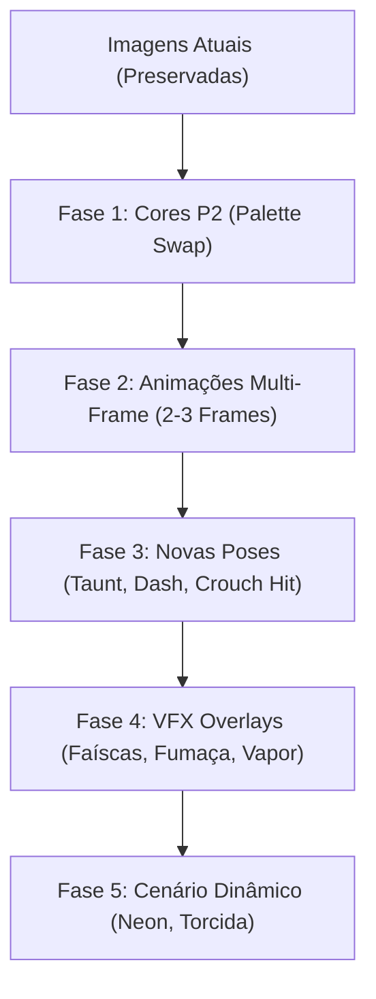

# Plano Mestre de Expansão Aditiva de Sprites
## CMSW — Combat Martial Soul Warriors

> [!IMPORTANT]
> **REGRA DE OURO ADITIVA:** Nenhuma imagem existente em `game/public/assets/sprites/` será excluída ou alterada. Todas as novas sprites e frames serão **adicionados** com novas chaves/sufixos (ex: `kevin_punch_2.png`, `vini_dog_p2_idle.png`), preservando 100% da estabilidade e funcionalidade atual do jogo.

---

---

## 📌 Detalhamento das Fases de Expansão

### 🎨 Fase 1: Cores Alternativas P2 (Palette Swap)
- **Objetivo:** Permitir partidas espelho (P1 vs P2) com diferenciação clara das roupas sem afetar o lutador original.
- **Novos Arquivos Adicionados:**
  - `kevin_p2_idle.png`, `kevin_p2_walk.png`, `kevin_p2_punch.png` (Bermuda vermelha / Camiseta preta).
  - `vini_dog_p2_idle.png`, `vini_dog_p2_walk.png`, `vini_dog_p2_punch.png` (Boné verde / Camisa vinho).
- **Integração:** `CharacterLoader` detecta automaticamente se P2 selecionou o mesmo lutador que P1 e carrega a variação `_p2`.

---

### 🎞️ Fase 2: Interpolação de Animações (Multi-Frame Scaling)
- **Objetivo:** Tornar os golpes e movimentos mais orgânicos e fluidos (estilo *Street Fighter II Alpha*).
- **Novos Arquivos Adicionados:**
  - `kevin_punch_2.png`, `vini_dog_punch_2.png` (Frame de extensão máxima do braço).
  - `kevin_kick_2.png`, `vini_dog_kick_2.png` (Frame de perna estendida no ápice).
  - `kevin_walk_2.png`, `vini_dog_walk_2.png` (Passo alternado de caminhada).
  - `kevin_special_2.png`, `vini_dog_special_2.png` (Lançamento da magia).
- **Integração:** O motor do `Fighter.ts` passa a alternar sequencialmente entre os frames `_1` e `_2` quando disponíveis.

---

### 🥊 Fase 3: Novas Poses e Comportamentos de Luta
- **Objetivo:** Adicionar profundidade tática e personalidade aos lutadores.
- **Novos Arquivos Adicionados:**
  - `kevin_taunt.png` & `vini_dog_taunt.png` (Provocação acionável via botão).
  - `kevin_dash.png` & `vini_dog_dash.png` (Esquiva/Arrancada rápida para frente/trás).
  - `kevin_crouch_hit.png` & `vini_dog_crouch_hit.png` (Reação ao receber dano agachado).
  - `kevin_win_alt.png` & `vini_dog_win_alt.png` (Pose secundária de comemoração).

---

### 🎆 Fase 4: VFX Overlays e Efeitos de Impacto
- **Objetivo:** Elevar o impacto dos acertos e magias com efeitos visuais marcantes.
- **Novos Arquivos Adicionados:**
  - `hit_spark_heavy.png` (Faísca de impacto forte no ponto de contato).
  - `block_spark.png` (Efeito azul/dourado ao bloquear golpes).
  - `vape_dog_cloud.png` (Animação da fumaça em forma de cachorro na vitória do Vini Dog).
  - `shower_steam.png` (Efeito de vapor no banheiro do Kevin na vitória).

---

### 🏙️ Fase 5: Cenários Dinâmicos e Animações de Fundo
- **Objetivo:** Dar vida aos cenários do jogo ("Bar do Pedro" / "C&M Software HQ").
- **Novos Arquivos Adicionados:**
  - `stage_neon_on.png` / `stage_neon_off.png` (Piscar do letreiro do Bar do Pedro).
  - `stage_crowd_cheer_1.png` / `stage_crowd_cheer_2.png` (Torcida vibrando no fundo).

---

## 🚀 Próximo Passo Recomendado
Iniciar pela **Fase 1 (Cores P2)** e **Fase 2 (Frames Extras de Soco/Chute)** por serem imediatas e trouxerem o maior impacto visual ao gameplay.
